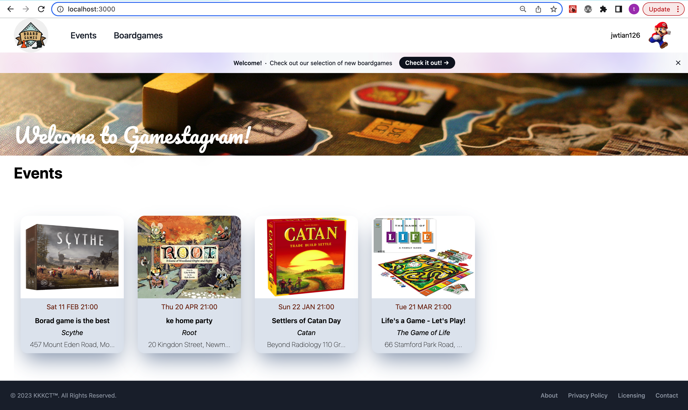

<!--  -->


# Gamestagram

Gamestagram is an web application designed to provide a platform for board game enthusiasts who struggle to find people to play with. By signing up to the platform, users can browse and join board game events hosted by other users, create their own events, and efficiently manage their events.

With Gamestagram, users will never have to worry about finding a group to play with, as they can easily connect with other like-minded individuals and enjoy their favorite games together.

## Key features

#### • Sign up and sign in with Google account or your prefered email

#### • Personal profile management, where users can update their details and preferences

#### • Join board game events hosted by other users

#### • Host their own board game events and manage them

#### • Receive email notifications if the event is cancelled

#### • Integration of external board game APIs to display game information

#### • Google Maps integration to display event location

## Tech stack

#### • TypeScript

#### • React

#### • Tailwindcss

#### • Auth0

#### • sendGrid

#### • REST API

#### • Google Map API

#### • SQLite (with knex)

#### • Express.js

#### • Zustand

#### • Jest

## Installation

#### 1. Clone this repository

#### 2. Install the packages

```
npm install

```

#### 3. Initialise the databse

```
npm run knex migrate:latest
npm run knex seed:run

```

#### 4. Run the application

```
npm run dev

```

#### 5. Browse the website

```
http://localhost:3000

```


## Stretch

#### 1.Instant messaging:

Allow users to send instant messages to other users to facilitate communication before or during events.

#### 2.Rating and reviews:

Enable users to rate and review other users after participating in an event to help build trust and accountability within the community.

#### 3.Event creation based on boardgames:

Allow users to create an event based on a specific board game they are browsing, making it easier for users to find and join events that interest them.

## Code Contributors
<a href="https://github.com/Dethorasis">
  
</a>
<a href="https://github.com/kason-cheong">
  
</a>
<a href="https://github.com/KemaxLong">
  
</a>
<a href="https://github.com/Kurt-Leong">
  
</a>
